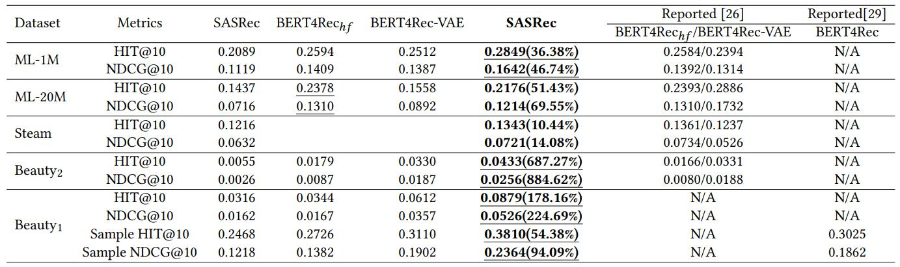
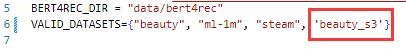
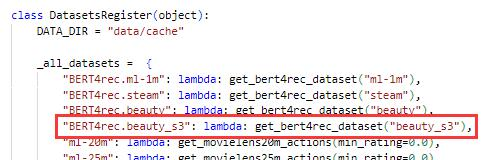

# Turorials for Aprec
## Preparation
1. git clone the aprec repo.
```
git clone https://github.com/asash/bert4rec_repro.git
```
2. follow its `README.md` to install relevant dependencies and test them.

3. add our implement:

* Replace the `bce.py` file in the `losses/` folder with the `bce.py` file we provided.
* Replace the `negative_per_positive_target.py` file in the `recommenders/dnn_sequential_recommender/target_builders/` folder with the `negative_per_positive_target.py` file we provided.
* Add our `ml-1m-benchmark.py` file at `evaluation/configs/bert4rec_repro_paper/` folder.

## Replicate result.


Run the command below at `evaluation/` folder to get our experiment result of Table 3.

```
CHECK_COMMIT_STATUS=false sh run_n_experiments.sh configs/bert4rec_repro_paper/ml-1m_benchmark.py
```

Note if you want to replicate the BERT4Rec results on the Beauty datasets can follow the step bellow:
* Add `beauty_s3.txt` to `data/bert4rec/` folder.
* Change 'datasets/bert4rec_datsets.py' file.



* Change 'datasets/datasets_register.py' file.



* Change the `DATASET` at config file 'ml-1m-benchmark.py'
* Run command `CHECK_COMMIT_STATUS=false sh run_n_experiments.sh configs/bert4rec_repro_paper/ml-1m_benchmark.py`