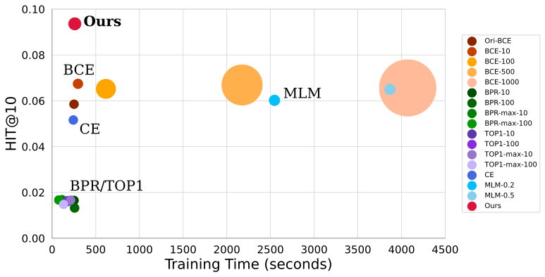

Our code is forked from https://github.com/aHuiWang/CIKM2020-S3Rec

We provide the replication code for all experimental results. The specific steps are as follows:

# Replicating Results of Enhanced Loss Function on CIKM2020-S3Rec


## Preparation 
```python
pip install -r requirements.txt
```

## Replicating Results

We provide a simple script file for one-step reproduction of the experimental results presented in the introduction section.

```python
python run_introduction_experiment.py
```

Result save at `.output/introduction/All_result.txt`, and the training log save at  `.output/introduction/.*`

## finetune
We support two evaluation methods. For more details, please check the ./reproduce directory.

+ Rank ground-truth item with 99 randomly sampled negative items
```shell script
python run_finetune_sample.py \
--data_name data_name \
--ckp pretrain_epochs_num
```

+ Rank the ground-truth item with all the items
```shell script
python run_finetune_full.py \
--data_name data_name \
--ckp pretrain_epochs_num
```


### Cite
If you find the our codes and datasets useful for your research or development, please cite our paper:

```
@inproceedings{DBLP:conf/cikm/ZhouWZZWZWW20,
  author    = {Kun Zhou and
               Hui Wang and
               Wayne Xin Zhao and
               Yutao Zhu and
               Sirui Wang and
               Fuzheng Zhang and
               Zhongyuan Wang and
               Ji{-}Rong Wen},
  title     = {S3-Rec: Self-Supervised Learning for Sequential Recommendation with
               Mutual Information Maximization},
  booktitle = {{CIKM} '20: The 29th {ACM} International Conference on Information
               and Knowledge Management, Virtual Event, Ireland, October 19-23, 2020},
  pages     = {1893--1902},
  publisher = {{ACM}},
  year      = {2020}
}
```

### Contact
If you have any question for our paper or codes, please send email to hui.wang@ruc.edu.cn.